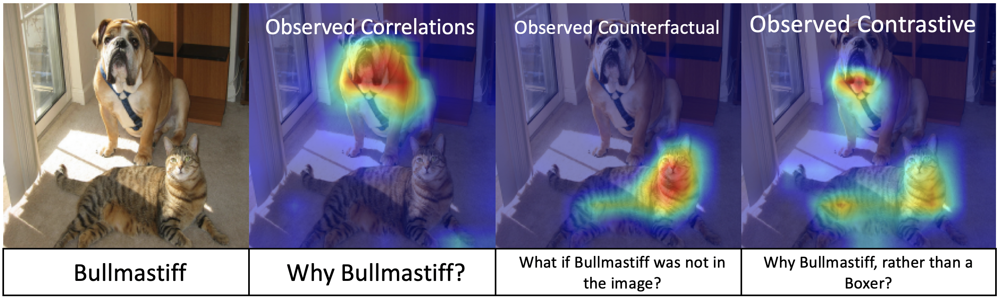

# Explanatory-Paradigms
Code used in the paper `Explanatory Paradigms in Neural Networks', published in the Signal Processing Magazine

**Abstract** 
In this article, we present a leap-forward expansion to the study of explainability in neural networks by considering explanations as answers to abstract reasoning-based questions. \hl{With \emph{P} as the prediction from a neural network, these questions are \emph{`Why P?'}, \emph{`What if not P?'}, and \emph{`Why P, rather than Q?'} for a given contrast prediction \emph{Q}. The answers to these questions are observed correlations, observed counterfactuals, and observed contrastive explanations respectively. Together, these explanations constitute the abductive reasoning scheme. We term the three explanatory schemes as observed explanatory paradigms. The term observed refers to the specific case of \emph{post-hoc} explainability, when an explanatory technique explains the decision $P$ after a trained neural network has made the decision $P$.} The primary advantage of viewing explanations through the lens of abductive reasoning-based questions is that explanations can be used as reasons while making decisions. The post-hoc field of explainability, that previously only justified decisions, becomes active by being involved in the decision making process and providing limited, but relevant and contextual interventions. The contributions of this article are: ($i$) realizing explanations as reasoning paradigms, ($ii$) providing a probabilistic definition of observed explanations and their completeness, ($iii$) creating a taxonomy for evaluation of explanations, and ($iv$) positioning gradient-based complete explanainability's replicability and reproducibility across multiple applications and data modalities.

 

The last four columns display the contrastive explanations.  

**Paper** : https://arxiv.org/abs/2008.00178 

**Code Acknowledgements** :  The code is built on Grad-CAM. We use the implementation of **https://github.com/1Konny/gradcam_plus_plus-pytorch** as our base code. Specifically, Recognition/utils.py and Recognition/gradcam.py are adapted. For the application of Image Quality Assessment, we use pretrained networks and network architecture from **https://github.com/lidq92/WaDIQaM**. Specifically, Image Quality Assessment/IQA.py and Image Quality Assessment/checkpoints are used.

**Citation** : 
